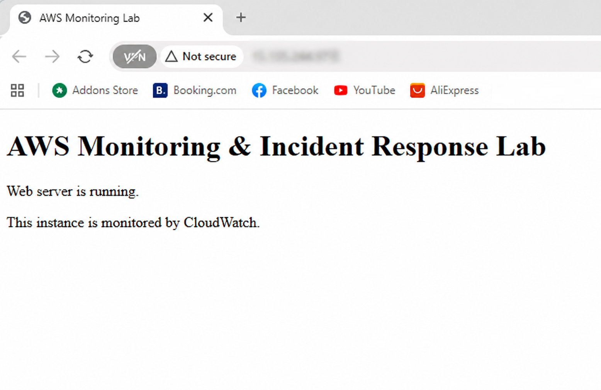
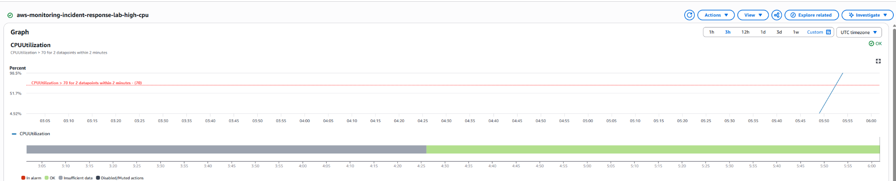
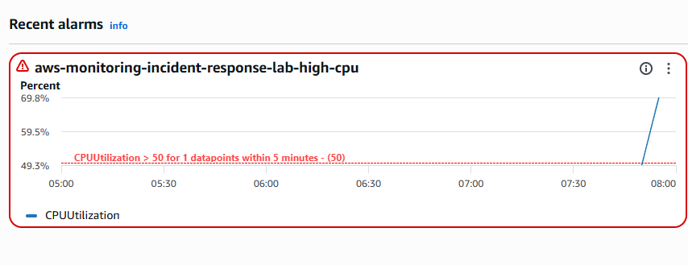
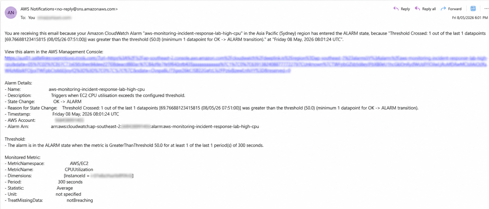

# AWS Monitoring & Incident Response Lab

## Overview

This project demonstrates a small AWS monitoring and incident response workflow using EC2, CloudWatch, SNS, and Terraform.

The goal is to simulate a basic cloud operations scenario: deploy a simple web server, monitor its CPU usage, trigger a CloudWatch alarm, receive an SNS email notification, and follow a documented incident response runbook.

## Why This Project Exists

Cloud support and cloud operations roles require more than deploying infrastructure. They require the ability to monitor systems, respond to alerts, investigate incidents, document findings, and improve reliability.

This lab demonstrates practical operational thinking around:

- AWS infrastructure
- Monitoring and alerting
- Incident response
- Documentation
- Runbooks
- Basic troubleshooting
- Infrastructure as Code

## Architecture

The lab provisions:

- An EC2 instance running a simple web server
- A security group allowing HTTP access
- CloudWatch metrics for EC2 CPU monitoring
- A CloudWatch alarm for high CPU usage
- An SNS topic for email notifications
- A documented incident response runbook

Architecture diagram to be added in `/architecture`.

## AWS Services Used

- EC2
- CloudWatch
- SNS
- IAM
- VPC / Security Groups
- Terraform

## Repository Structure

```text
aws-monitoring-incident-response-lab/
  README.md
  architecture/
  screenshots/
  runbooks/
    high-cpu-alarm-response.md
  terraform/
    versions.tf
    provider.tf
    variables.tf
    main.tf
    outputs.tf
    terraform.tfvars.example
```

## Incident Simulation

A high CPU incident was simulated on the EC2 instance using `stress-ng`.

During initial testing, the CPU spike was visible in CloudWatch, but the original 1-minute alarm configuration did not reliably trigger with EC2 basic monitoring. The alarm was adjusted to a 5-minute evaluation period to match standard EC2 metric resolution.

Final alarm configuration:

- Metric: `CPUUtilization`
- Namespace: `AWS/EC2`
- Threshold: greater than `50%`
- Period: `300 seconds`
- Evaluation periods: `1`
- Datapoints to alarm: `1`

This allowed the alarm to transition into `ALARM` state and send an SNS email notification.

## Screenshots

### Web Server Running



### CPU Spike Visible in CloudWatch



### CloudWatch Alarm Triggered



### SNS Email Alert Received



## Incident Response Runbook

See:

```text
runbooks/high-cpu-alarm-response.md
```

## Cleanup

Resources are destroyed after testing using:

```bash
terraform destroy
```

## What I Learned

This project reinforced that monitoring configuration must match the resolution and behaviour of the underlying metrics.

In this case, EC2 basic monitoring did not reliably support the original 1-minute alarm evaluation settings. Adjusting the CloudWatch alarm to use a 5-minute period made the alerting workflow behave reliably.

The lab also demonstrates the importance of:

- Validating alerts with real test conditions
- Tuning alarm thresholds and evaluation periods
- Documenting incident response steps
- Destroying test infrastructure after use